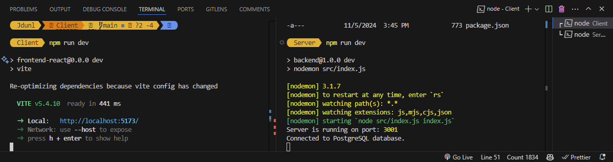

# .env setup

Everyone should create a .env file inside the 'Server' folder. This holds the password for your local PostgreSQL instance as well as the session secret. Here are the two lines you should put in the file:

```python
DB_PASSWORD = 'your_pgadmin_password_here'
SESSION_SECRET = 'apAPS*RcU^o2MjonW%9i'
```

The session token is arbirtary, but this ensures we're all using the same instance of it.

# DB Setup

Here are some script templates we can use to ensure we all have the same table records when developing. Edit as needed. 

* Create new Database in PgAdmin labeled CS312_Group_Project
* Execute following script to create tables used in project.
* Uncomment DROP commands to drop and recreate tables with fresh data as needed.
* (Passwords for test users are just their first names. E.g. 'Alice' is the password for Alice. Hashed through bcrypt.)

---

```pgsql
------------ CREATE TABLES ------------
-- Uncomment DROP commands after initial table creation! Used to reset DB for debugging
--DROP TABLE users, artists, albums, songs, album_songs,playlists, playlist_songs CASCADE;

CREATE TABLE users (
    user_id SERIAL PRIMARY KEY,
    user_email TEXT UNIQUE NOT NULL,
    full_name TEXT,
    password TEXT NOT NULL 
);

CREATE TABLE artists (
    artist_id SERIAL PRIMARY KEY,
    artist_name TEXT NOT NULL,
    bio TEXT 
);

CREATE TABLE ALBUMS (
    album_id SERIAL PRIMARY KEY,
    album_title TEXT NOT NULL
);

CREATE TABLE SONGS (
    song_id SERIAL PRIMARY KEY,
    song_title TEXT NOT NULL,
    local_link_ref TEXT NOT NULL,
    artist_id INT REFERENCES artists(artist_id) NOT NULL,
    album_id INT REFERENCES albums(album_id) NOT NULL,
    release_date DATE
);

CREATE TABLE album_songs (
    album_id INT REFERENCES albums(album_id) NOT NULL,
    song_id INT REFERENCES songs(song_id) NOT NULL,
    track_number INT NOT NULL,
    PRIMARY KEY (album_id, song_id) 
);

CREATE TABLE playlists (
    playlist_id SERIAL PRIMARY KEY,
    user_id INT REFERENCES users(user_id) NOT NULL,
    playlist_name TEXT NOT NULL
);

CREATE TABLE playlist_songs (
    playlist_id INT REFERENCES playlists(playlist_id) NOT NULL,
    song_id INT REFERENCES songs(song_id) NOT NULL,
    song_order INT NOT NULL,
    PRIMARY KEY (playlist_id, song_id)
);

------------ POPULATE TABLES WITH DATA ------------
INSERT INTO users (full_name, user_email, password) VALUES
('Alice Jones', 'alice12jones@gmail.com', '$2b$10$jOJcKvoN602Wxjxzs65t2OuQe.Prh7bWU6LL74VrPDV9z8UGFRvOK'),
('Bob Gnarly', 'bobsnotdead@gmail.com', '$2b$10$BjFEXzmLjQZ608WbahLQ2.k7pQbC0ix8TPfUsRYlRWl.F71cpXhaq'),
('Charlie Bucket', 'charlie4210@gmail.com', '$2b$10$lnFT6VcFXiQmNptQfTpX7edfX6UpZHEXf4BLWUE8oupEJbnU9tVgS');


-- Debugging
-- SELECT * FROM users
-- SELECT * FROM music
-- SELECT * FROM 
```

# Client/Server Folders

The easiest way to have frontend/backend separated (atleast from the few videos I watched) was with designated folders. This does mean there are two separate instances you need to start. 

* Open the terminal and navigate to the Client folder. Type 'npm run dev'.
* Open a new terminal window and navigate to the server folder. Type 'npm run dev'.
* You can have them side by side like this:



The right side will console log debugging statements from the backend "Server" setup. The left side is the localhost and port where we can view our React app. 

Port 5173 for React. Port 3001 for Express.
